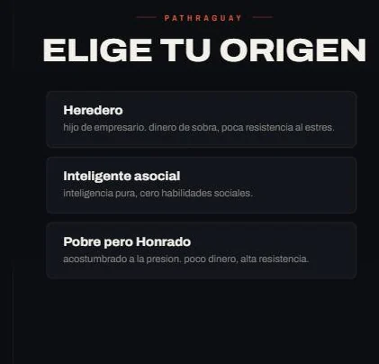
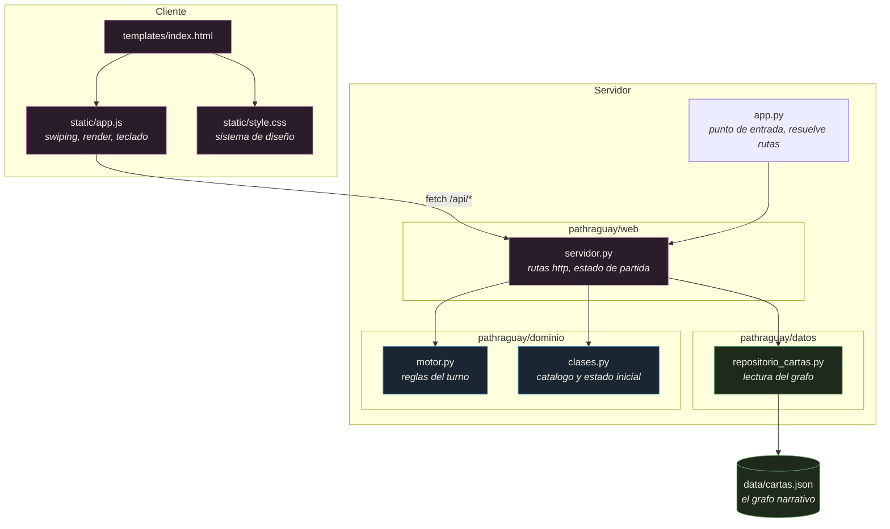
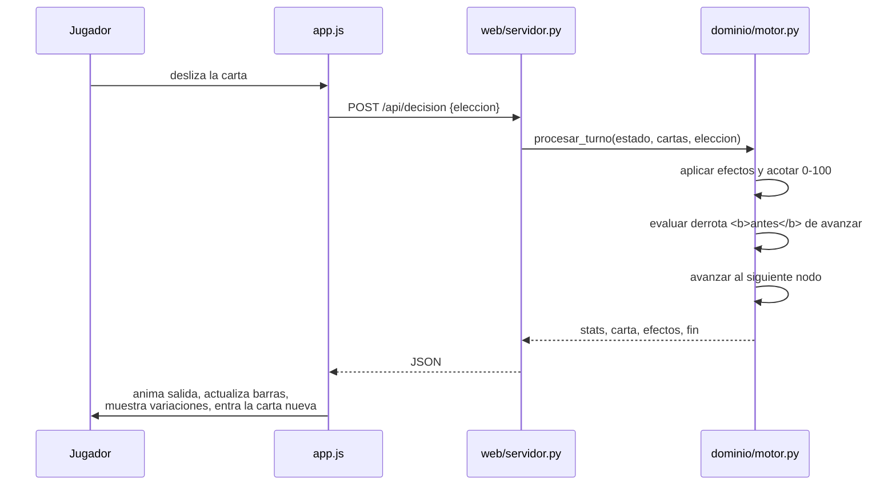
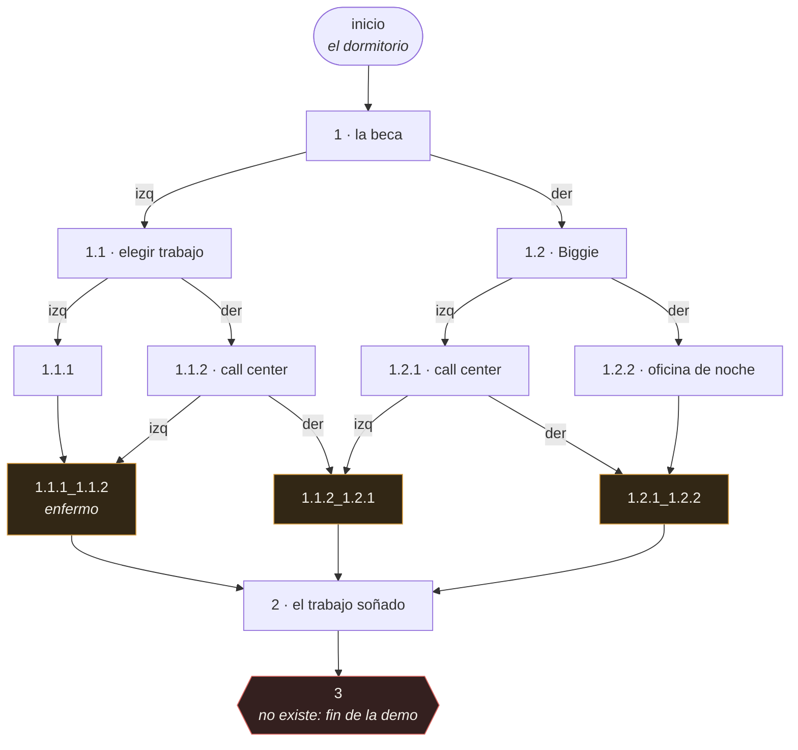

<div align="center">

# Pathraguay

**Simulador narrativo de decisiones sobre la vida adulta en Paraguay.**

Terminaste el colegio. Tenes dieciocho años, cinco atributos y una sola
decision por vez. Cada carta que deslizas cierra una puerta.


<br />


&nbsp;&nbsp;


</div>

---

## Que es

Un juego de cartas por deslizamiento, al estilo de *Reigns*, ambientado en las
tensiones concretas de arrancar la vida adulta en Paraguay: la beca de Itaipu,
el primer empleo, el turno en el IPS, el call center, el trabajo soñado.

Cada carta plantea una situacion y dos salidas. Cada salida mueve cinco
atributos y lleva a otro nodo del grafo. Si la salud llega a cero o el dinero
se va por debajo de cero, la partida termina.

No hay respuesta correcta. Hay costos.

## Como correrlo

```bash
git clone https://github.com/Cesahz/hackathon-6.0.git
cd hackathon-6.0

python -m venv .venv
source .venv/bin/activate      # en Windows: .venv\Scripts\activate

pip install -r requirements.txt
python app.py
```

Abrir <http://127.0.0.1:5000>.

> [!NOTE]
> `app.py` levanta el servidor de desarrollo de Flask, pensado para trabajar
> en local. No es apto para produccion.
>
> El piso de Python es 3.9, que es el que exige Flask 3.x; el codigo en si no
> usa nada posterior a 3.8. Se desarrolla y se prueba sobre 3.13.

## Como se juega

| Accion | Con mouse | En tactil | Con teclado |
|---|---|---|---|
| Ver la opcion izquierda | pasar sobre `❮` | arrastrar a la izquierda | — |
| Ver la opcion derecha | pasar sobre `❯` | arrastrar a la derecha | — |
| Elegir la izquierda | clic en `❮` | soltar a la izquierda | `←` |
| Elegir la derecha | clic en `❯` | soltar a la derecha | `→` |

Los cuatro primeros atributos van de 0 a 100. El dinero no tiene techo, se
mide en guaranies y puede volverse negativo, que es justamente la derrota.

## Arquitectura

Cliente y servidor separados, y dentro del servidor tres capas con las
dependencias apuntando hacia adentro. El dominio no sabe que existe la web ni
el disco.



| Capa | Responsabilidad | Puede importar |
|---|---|---|
| `pathraguay/dominio` | Reglas del juego y catalogo de clases | nada del proyecto |
| `pathraguay/datos` | Lectura del grafo desde disco | nada del proyecto |
| `pathraguay/web` | Rutas HTTP y estado de la partida | dominio y datos |
| `app.py` | Punto de entrada. Unico modulo que conoce el layout en disco | web |

`app.py` resuelve las rutas del proyecto y se las inyecta a `crear_app()`.
Ninguna capa interna sabe donde viven los archivos, lo que ademas permite que
cada prueba levante su propia aplicacion aislada.

### El recorrido de un turno



## El grafo narrativo

El juego **es** un archivo JSON. `data/cartas.json` define un grafo dirigido
donde cada nodo es una carta y cada opcion una arista.



Las ramas **convergen**: `1.1.1` y `1.1.2` desembocan en el mismo nodo, igual
que los otros dos pares. Eso permite abrir decisiones sin que la cantidad de
contenido se duplique en cada bifurcacion.

El nodo `3` no existe a proposito. Cuando el motor encuentra un destino que no
esta en el grafo, cierra la partida con un mensaje de fin de recorrido. Un
final es, sencillamente, una arista que apunta afuera.

### Agregar contenido

No hace falta tocar codigo. Ningun `if` del motor conoce identificadores de
nodo: agregar una rama narrativa es agregar datos.

```jsonc
"mi_nodo": {
    "texto": "La situacion que enfrenta el jugador.",
    "img": "/static/img/dormitorio.webp",
    "opcion_izq": {
        "texto": "Lo que dice el boton de la izquierda",
        "siguiente_id": "otro_nodo",
        "efectos": { "salud": -10, "dinero": 200000,
                     "intelecto": 0, "laboral": 5, "social": 0 }
    },
    "opcion_der": { "...": "igual que la izquierda" }
}
```

Tambien existe `herramientas/generador_cartas.py`, una utilidad de linea de
comandos para redactar cartas sin editar el JSON a mano.

> [!IMPORTANT]
> Las pruebas de `tests/test_grafo.py` validan el contenido publicado: que
> todo nodo sea alcanzable desde el inicio, que ninguna rama deje al jugador
> en un ciclo sin salida, que los efectos declaren las cinco estadisticas y
> que no haya identificadores duplicados. Si agregas contenido roto, la suite
> lo dice antes que el jugador.

### Sobre la escalabilidad del grafo

El grafo se carga entero en memoria una vez, al levantar el servidor. Es una
decision consciente y no un descuido pendiente.

Con el volumen actual el archivo pesa once kilobytes, y agregar contenido no
requiere tocar codigo en ningun lado. Introducir carga diferida, indices o una
base de datos agregaria complejidad sin resolver ningun problema que hoy
exista. Cuando el proyecto sostenga varias historias en paralelo, esa decision
se revisa; hasta entonces, se mantiene.

## Pruebas

```bash
pip install -r requirements-dev.txt
python -m pytest
```

Cien pruebas repartidas en seis archivos:

| Archivo | Cubre |
|---|---|
| `test_motor.py` | Efectos, limites, derrotas, aislamiento del grafo e invariantes sobre el recorrido exhaustivo de todas las decisiones |
| `test_api.py` | El contrato HTTP de cada endpoint, que el cliente lee por nombre |
| `test_clases.py` | Catalogo, rangos iniciales y aislamiento entre partidas |
| `test_grafo.py` | Integridad del contenido publicado |
| `test_imagenes.py` | Que toda referencia a una imagen resuelva a un archivo real |
| `test_version.py` | Consistencia entre la version del paquete y el changelog |

Las pruebas de reglas usan grafos sinteticos, para no atarse a la narrativa
que se publique. Las de integridad usan `data/cartas.json`.

La suite se valido introduciendo diez defectos deliberados en el codigo y en
los datos —entre ellos cambiar el corte de bancarrota, devolver la carta sin
clonar, quitar el techo de las estadisticas y desfasar las mayusculas de una
ruta de imagen. Los diez fueron detectados.

## Herramientas

```bash
python herramientas/verificar_imagenes.py   # valida el mapeo de ilustraciones
python herramientas/generador_cartas.py     # asistente para redactar cartas
```

`verificar_imagenes.py` recorre las referencias de `cartas.json`, `app.js`,
`index.html` y `style.css`, y falla si alguna no resuelve a un archivo
existente. Compara contra el listado del directorio en vez de preguntar si el
archivo existe, porque Windows y macOS ignoran mayusculas y dejarian pasar un
desfasaje que rompe recien al desplegar en Linux.

## Estructura

```
app.py                      punto de entrada
pathraguay/
├── dominio/                reglas del juego, sin dependencias
│   ├── motor.py
│   └── clases.py
├── datos/
│   └── repositorio_cartas.py
└── web/
    └── servidor.py
data/cartas.json            el grafo narrativo
static/                     cliente: js, css, ilustraciones
templates/index.html
herramientas/               utilidades de autoria y verificacion
tests/                      cien pruebas
docs/                       documentacion e imagenes
CHANGELOG.md
```

## Convenciones

- **Escritura.** Comentarios y mensajes de commit en impersonal o infinitivo,
  sin tildes y en minuscula salvo nombres propios. Los comentarios de Python
  no llevan espacio despues del `#`. El texto del juego es contenido y
  conserva su ortografia completa.
- **Commits.** Convencionales: `feat:`, `fix:`, `refactor:`, `docs:`,
  `test:`, `chore:`, `perf:`.
- **Ramas.** Nadie hace push directo a `main`. Todo entra por Pull Request.
- **Imagenes.** Las ilustraciones viajan en WebP con tope de 1200 pixeles de
  ancho. Los originales quedan fuera del repositorio. Ningun renombrado se da
  por terminado sin correr `verificar_imagenes.py`.

## Estado

Version **0.2.0**. El juego es jugable de punta a punta, pero es una demo: son
doce nodos, el balance nunca se ajusto y nadie lo probo de forma sistematica.

El [CHANGELOG](CHANGELOG.md) detalla que significa llegar a `1.0.0` y todo lo
que falta para eso, ordenado por contenido, balance, testeo, identidad y
operacion.

## Creditos

Proyecto ganador de la hackathon **CodePRO 5.1**, marzo de 2026.

| | |
|---|---|
| [Cesahz](https://github.com/Cesahz) | Motor, integracion y arquitectura |
| Kento Nishikawa | Narrativa, HTML y estilos |
| Pablo Bogarin | Carga de cartas e inicializacion de clases |
| Juan Vicente Gonzalez | Estado de partida y frontend |
| josiascolman117-hue | Pantalla de seleccion de clase |
